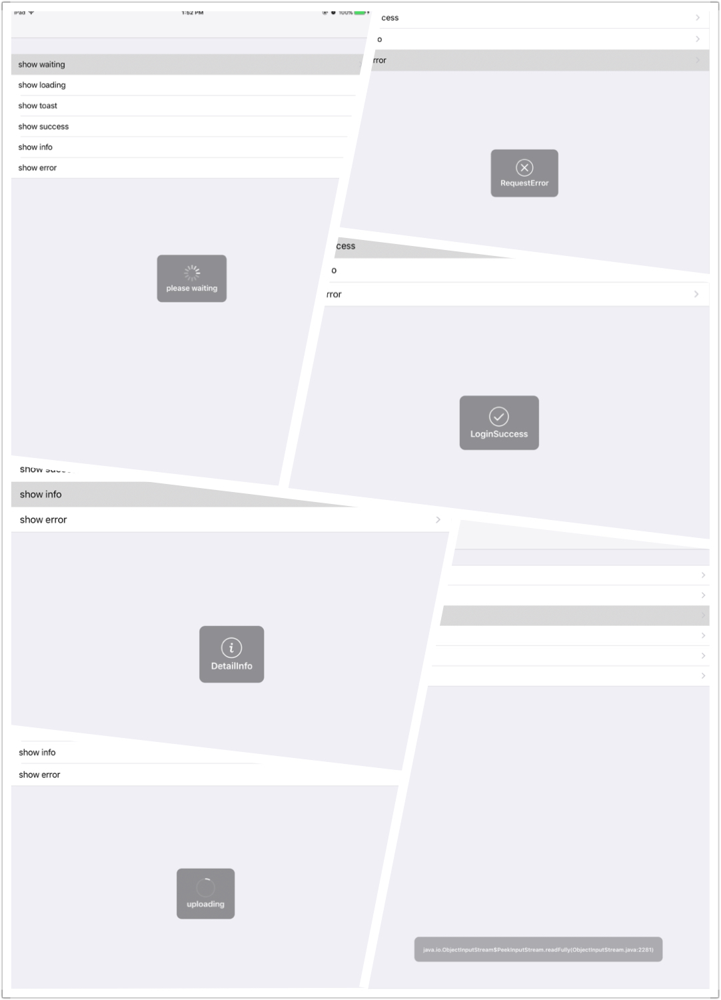

# MBProgressHUD-Swift

前段时间在github上找hud库，有的很炫酷，但不太适合集成在项目中。
感谢[powfulhong](https://github.com/powfulhong "powfulhong")的项目[MBProgressHUDForSwift](https://github.com/powfulhong/MBProgressHUDForSwift "MBProgressHUDForSwift")。本项目将[MBProgressHUDForSwift](https://github.com/powfulhong/MBProgressHUDForSwift "MBProgressHUDForSwift")更新至swift3.0并且兼容swift4。本项目在此基础上进行简单的封装。

## 封装
为UIResponder实现ProgressHudProtocol协议，使用起来更加方便。继承自UIResponder的类，例如UINavigationController、UIViewController、UIView等都可以调用一下方法。当然你也可以为MBProgressHUD自定义view。

```
public func showWaiting(_ text: String? = nil, detail: String? = nil)
    
public func showLoading(progress: Float, text: String? = nil, detail: String? = nil) 
    
public func showToast(_ text: String, offset: CGFloat = 0, hideAfter delay: TimeInterval? = 2)
    
public func showSuccess(_ text: String? = nil, detail: String? = nil, hideAfter delay: TimeInterval? = 2) 
    
/// it will show toast style while text's width more than 120
public func showError(_ error: Error, hideAfter interval: TimeInterval? = 2) 
    
public func showInfo(_ text: String? = nil, detail: String? = nil, hideAfter delay: TimeInterval? = 2) 
    
public func showStatus(_ status: ProgressHudStatus, text: String? = nil, detail: String? = nil, hideAfter delay: TimeInterval? = nil) 
    
public func hideHUD(_ animated: Bool = true, afterDelay delay: TimeInterval = 0)


```


## 效果图


